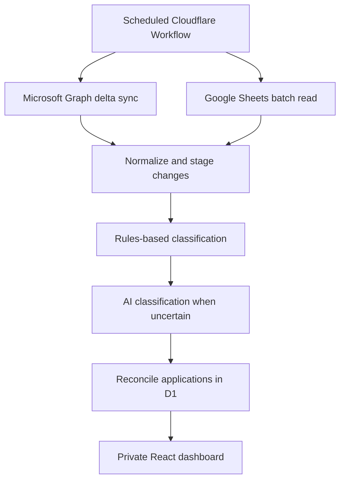

# Job Intelligence Platform

## Architecture and Implementation Plan

**Document version:** 1.0
**Date:** October 1, 2026
**Status:** Version-one implementation complete; publication and hosted release gates in progress
**Primary platform:** Cloudflare Workers, Workflows, Pages, and D1

---

## 1. Purpose

The Job Intelligence Platform will consolidate job-application activity from two primary sources:

1. Job-related email in Microsoft Outlook
2. The existing Google Sheets job-application tracker

The platform will identify application confirmations, recruiter responses, interview requests, assessments, follow-ups, rejections, offers, and other job-related events. It will extract structured information such as company, position, requisition ID, dates, source message identifiers, and current application status.

The resulting data will support a private application dashboard containing charts, searchable tables, timelines, conversion metrics, follow-up alerts, and reconciliation results between Outlook and Google Sheets.

The platform must remain inexpensive, secure, incremental, explainable, and maintainable.

---

## 2. Objectives

The solution will:

- Import historical job-related Outlook messages from a selected starting date.
- Fetch only new, modified, moved, or deleted Outlook messages during subsequent runs.
- Read the current Google Sheets tracking range and process only new or changed rows.
- Determine whether each message is job-related.
- Categorize job-related messages by event type.
- Extract company, position, requisition ID, dates, job URL, and other relevant information.
- Connect related messages and spreadsheet rows to one canonical application.
- Preserve source evidence and the complete application event history.
- Identify missing records and conflicts between Outlook and Google Sheets.
- Provide a private dashboard for analysis and manual correction.
- Minimize AI requests through deterministic rules, hashing, and confidence thresholds.
- Prevent the system from sending email or changing source data without explicit future authorization.

---

## 3. Architectural Principles

### 3.1 D1 is the canonical application database

Outlook and Google Sheets are source systems. Cloudflare D1 will contain the reconciled application record, normalized events, classification decisions, source references, and manual overrides.

Source data will not be silently overwritten. Conflicting evidence will be preserved and surfaced for review.

### 3.2 Synchronization is incremental and idempotent

Microsoft Graph delta queries will retrieve mailbox changes instead of rescanning the mailbox. Google Sheets rows will be fingerprinted so unchanged rows are not reprocessed.

All inserts and updates must be safe to repeat. A failed or retried workflow must not create duplicate messages, applications, or events.

### 3.3 Rules run before AI

Known senders, ATS domains, subject patterns, requisition formats, and status language will be evaluated before an AI model is called. AI classification will be reserved for ambiguous messages and extraction tasks that deterministic rules cannot complete confidently.

### 3.4 Every derived value retains provenance

The application must distinguish among:

- Values explicitly found in an email
- Values supplied by Google Sheets
- Values inferred by rules
- Values suggested by an AI model
- Values manually verified by the user

### 3.5 Private job data remains private

The job tracker and email-derived data will be available only through an authenticated private area. They will not be exposed through the public portfolio or the public Ask Branden chatbot.

---

## 4. Recommended Technology Stack

| Layer | Technology | Responsibility |
|---|---|---|
| User interface | React and TypeScript on Cloudflare Pages | Private dashboards, tables, timelines, reconciliation, and review |
| Application API | TypeScript Cloudflare Worker | Authenticated CRUD, search, analytics, manual review, and connection management |
| ETL orchestration | Scheduled Cloudflare Workflow | Durable daily synchronization, checkpoints, retries, and run history |
| Operational database | Cloudflare D1 | Canonical applications, events, messages, source rows, decisions, and sync state |
| Outlook integration | Microsoft Graph API v1.0 | Outlook message retrieval and incremental synchronization |
| Spreadsheet integration | Google Sheets API v4 | Read the configured tracker ranges |
| Classification | Rules engine plus a small model through Cloudflare AI Gateway | Message classification and structured field extraction |
| Authentication | Microsoft delegated OAuth, Google service account or OAuth, and private app authentication | Secure source connections and dashboard access |
| Secrets | Cloudflare Worker secrets | Encryption keys, OAuth client secrets, and Google credentials |
| Optional asynchronous scale | Cloudflare Queues | Large historical backfills or future classification backlogs |

---

## 5. Logical Architecture



### 5.1 Separation of responsibilities

- The **API Worker** serves the application and handles user-initiated operations.
- The **scheduled Workflow** runs ETL steps and records checkpoints.
- **D1** stores application state and source lineage.
- **Microsoft Graph** and **Google Sheets** remain external data providers.
- **AI Gateway** controls model usage, logging, rate limits, and spending.

The scheduled process should not depend on the frontend being open.

---

## 6. Microsoft Outlook Integration

### 6.1 API and authentication

Use the Microsoft Graph API v1.0 with Microsoft Identity Platform OAuth 2.0 authorization-code flow.

Required delegated permissions:

- `Mail.Read`
- `offline_access`
- `User.Read`

The application will not request `Mail.Send` because sending email is outside the authorized scope.

The refresh token will be encrypted before it is stored in D1. The encryption key will be stored as a Cloudflare Worker secret and will never be written to D1 or the source repository.

### 6.2 Initial historical import

The first synchronization will import messages from a user-selected starting date. The initial scope will include:

- Inbox
- Sent Items
- Additional explicitly configured job folders, if needed

The importer will page through results, commit each page safely, and checkpoint progress so a failed import can resume.

### 6.3 Incremental synchronization

Use the following folder-level Microsoft Graph endpoints:

```http
GET https://graph.microsoft.com/v1.0/me/mailFolders/inbox/messages/delta
GET https://graph.microsoft.com/v1.0/me/mailFolders/sentitems/messages/delta
```

The entire final `@odata.deltaLink` will be stored for each tracked folder. The next daily run will call the stored link to retrieve only changes since the previous successful run.

Every applicable request will include:

```http
Prefer: IdType="ImmutableId"
```

Immutable IDs prevent a message from appearing to be a new record simply because it was moved to a different folder in the same mailbox.

### 6.4 Initial message projection

The lightweight synchronization request should retrieve:

- `id`
- `internetMessageId`
- `conversationId`
- `subject`
- `from`
- `toRecipients`
- `receivedDateTime`
- `sentDateTime`
- `lastModifiedDateTime`
- `parentFolderId`
- `bodyPreview`
- `webLink`

The full body will not be downloaded for every message. A second Graph request will retrieve the cleaned text body only when the subject, sender, and preview indicate that the message may be job-related but do not provide enough information to classify or match it.

### 6.5 Message deletion and movement

Delta responses can indicate that a message was deleted or removed from a folder. The system will retain the derived application event and source metadata while marking the source message as removed or unavailable. This avoids rewriting historical application activity because an Outlook message was later deleted.

---

## 7. Google Sheets Integration

### 7.1 API

Use Google Sheets API v4:

```http
GET https://sheets.googleapis.com/v4/spreadsheets/{spreadsheetId}/values:batchGet
```

The request will retrieve only the configured worksheet and used data ranges.

### 7.2 Authentication recommendation

For the initial single-user implementation:

1. Create a Google service account.
2. Share only the tracking spreadsheet with the service-account email as a Viewer.
3. Store the private credential as a Cloudflare Worker secret.
4. Use read-only spreadsheet access.

If the platform later supports other users connecting their own spreadsheets, replace this with Google OAuth.

### 7.3 Change detection

The Sheets API call will retrieve the current tracker range once daily. Each row will receive a normalized content hash. D1 will compare that hash with the previous imported version.

- New hash: insert and reconcile the row.
- Changed hash: update the source snapshot and rerun reconciliation.
- Unchanged hash: take no further action.
- Missing prior row: mark it as removed from the current sheet, but preserve its history.

### 7.4 Recommended tracking columns

The sheet should include these fields where practical:

- Company
- Position
- Requisition ID
- Job URL
- Applied Date
- Current Status
- Job Source
- Location
- Notes
- Application ID

`Application ID` should eventually contain the canonical D1 application UUID. Until that identifier is available, the reconciler will use requisition ID, normalized URL, company, position, and applied date.

The first release will treat the sheet as read-only. Automatic write-back can be considered separately after reconciliation is stable.

---

## 8. Data Model

### 8.1 Core tables

| Table | Purpose |
|---|---|
| `applications` | Canonical record for each job application |
| `organizations` | Normalized company names, domains, and aliases |
| `message_references` | Outlook message metadata and retained excerpts |
| `application_events` | Historical application activity from all sources |
| `sheet_rows` | Current and historical snapshots of tracker rows |
| `classification_decisions` | Rules and AI classification results with version and confidence |
| `reconciliation_matches` | Links and comparison results between applications and source records |
| `manual_overrides` | User-verified values that take precedence over automated values |
| `sync_state` | Graph delta links, Sheets hashes, and provider checkpoints |
| `sync_runs` | ETL run status, counts, timing, warnings, and errors |
| `follow_up_tasks` | Optional follow-up recommendations and due dates |

### 8.2 Key application fields

The `applications` table should include:

- Application UUID
- Organization ID
- Company display name
- Company domain
- Position title
- Normalized position title
- Requisition ID
- Job URL
- Job source
- Location
- Applied date
- Current status
- Last activity date
- Follow-up date
- Match confidence
- Manual lock indicator
- Created and updated timestamps

### 8.3 Key message fields

The `message_references` table should include:

- Microsoft account ID
- Graph immutable message ID
- Internet message ID
- Conversation ID
- Parent folder ID
- Outlook web link
- Sender address
- Sender domain
- Recipient summary
- Subject
- Normalized subject
- Received timestamp
- Sent timestamp
- Last modified timestamp
- Body preview
- Cleaned retained excerpt
- Content hash
- Removed indicator
- Classification state

### 8.4 Application event types

The initial event taxonomy will include:

- `application_submitted`
- `application_confirmation`
- `recruiter_outreach`
- `screening_request`
- `assessment_requested`
- `assessment_completed`
- `interview_requested`
- `interview_scheduled`
- `interview_completed`
- `follow_up_sent`
- `follow_up_received`
- `rejection`
- `offer`
- `withdrawal`
- `position_closed`
- `other_job_related`

An email creates an event. It does not directly erase earlier events. The current application status is derived from verified events and overrides.

### 8.5 Uniqueness and idempotency

At minimum, enforce uniqueness for:

- Provider account plus Graph immutable message ID
- Spreadsheet ID, worksheet ID, and stable source-row key
- Source type, source record ID, and event type
- Requisition ID plus organization when the requisition ID is known to be reliable

D1 batch transactions should commit related message, event, reconciliation, and checkpoint changes together where practical.

---

## 9. Classification and Extraction

### 9.1 Rules engine

The rules engine will examine:

- Sender address and sender domain
- Known applicant-tracking-system domains
- Job-board and recruiter domains
- Subject patterns
- Body-preview keywords
- Requisition ID patterns
- Existing conversation associations
- Company domains already linked to applications
- Known rejection, interview, assessment, confirmation, and offer phrases

Rules should return:

- Job-related indicator
- Proposed event type
- Extracted values
- Candidate application matches
- Rule identifiers that fired
- Confidence score

### 9.2 AI classifier

AI will process only messages that remain uncertain or require structured extraction. The model will receive the minimum necessary data:

- Sender and sender domain
- Subject
- Cleaned body preview or limited excerpt
- Candidate application summaries
- Required output schema

The expected result will be structured JSON:

```json
{
  "is_job_related": true,
  "event_type": "interview_requested",
  "company": "Example Company",
  "position": "Senior Data Analyst",
  "requisition_id": "REQ-12345",
  "event_date": "2026-10-01",
  "application_match_id": null,
  "confidence": 0.94
}
```

The result must pass schema validation before it is written to D1.

### 9.3 Cost controls

- Use deterministic rules first.
- Hash the classification input.
- Cache by `content_hash + classifier_version`.
- Do not reclassify unchanged messages.
- Batch compatible requests when supported.
- Set AI Gateway rate limits and spending limits.
- Record input and output token usage by sync run.
- Route low-confidence results to review instead of repeatedly calling larger models.

### 9.4 Classification review

The review queue will display:

- Source message link
- Proposed classification
- Extracted company, position, requisition, and date
- Candidate application matches
- Confidence
- Rules or model version used

The user can accept, edit, exclude, create a new application, or merge with an existing application. Manual decisions become training and rule-improvement evidence but do not automatically fine-tune a model.

---

## 10. Reconciliation Logic

### 10.1 Match hierarchy

Use the following order:

1. Existing canonical Application ID
2. Requisition ID and organization
3. Normalized job URL
4. Existing Outlook conversation association
5. Organization, normalized position, and compatible application date
6. AI-suggested match requiring confidence evaluation
7. Manual review

Low-confidence matching must never silently merge applications.

### 10.2 Reconciliation states

| State | Meaning |
|---|---|
| `matched` | Outlook and Google Sheets records correspond and material values agree |
| `email_only` | Outlook contains application evidence with no matching tracker row |
| `sheet_only` | The tracker contains an application with no matching Outlook evidence |
| `conflict` | Sources match but disagree on status or another material field |
| `needs_review` | One or more candidate matches exist without sufficient confidence |
| `excluded` | Record was manually determined not to be relevant |

### 10.3 Value precedence

1. Manual verified override
2. Explicit source evidence, such as an offer, rejection, or interview message
3. Google Sheets value
4. Deterministic inference
5. AI suggestion

Precedence does not delete lower-priority evidence. All source values remain available for audit and troubleshooting.

---

## 11. Daily ETL Workflow

The scheduled Workflow will execute these steps:

1. Create a `sync_runs` record.
2. Acquire a run lock to prevent overlapping daily executions.
3. Refresh Microsoft credentials.
4. Follow the saved Graph delta link for each tracked folder.
5. Upsert new, updated, removed, or moved message records.
6. Refresh Google credentials.
7. Read configured spreadsheet ranges with `values:batchGet`.
8. Calculate row hashes and stage only new or changed rows.
9. Run deterministic classification on changed messages.
10. Retrieve a limited message body only when necessary.
11. Send uncertain messages through AI Gateway.
12. Validate structured model responses.
13. Match source records to canonical applications.
14. Create or update application events.
15. Recalculate current application states.
16. Produce reconciliation results.
17. Refresh or calculate dashboard aggregates.
18. Commit the final Graph delta links and Sheets checkpoint.
19. Mark the run successful and record metrics.

If a step fails, the Workflow will retry that step according to its retry policy. A cursor or delta link must not advance until the corresponding source page has been safely committed.

---

## 12. API Worker Surface

Suggested private endpoints:

```text
GET    /api/job-intelligence/dashboard
GET    /api/job-intelligence/applications
GET    /api/job-intelligence/applications/:id
PATCH  /api/job-intelligence/applications/:id
GET    /api/job-intelligence/events
GET    /api/job-intelligence/reconciliation
POST   /api/job-intelligence/reconciliation/:id/resolve
GET    /api/job-intelligence/review
POST   /api/job-intelligence/review/:id/decision
GET    /api/job-intelligence/sync-runs
POST   /api/job-intelligence/sync/run
GET    /api/job-intelligence/connections
POST   /api/job-intelligence/connections/microsoft/start
GET    /api/job-intelligence/connections/microsoft/callback
DELETE /api/job-intelligence/connections/microsoft
```

Manual synchronization should call the same Workflow used by the daily schedule instead of implementing a second ETL path.

---

## 13. Dashboard Requirements

### 13.1 Summary metrics

- Total applications
- Applications submitted this week and month
- Active applications
- Response rate
- Rejection rate
- Screening conversion
- Interview conversion
- Offer conversion
- Average time to first response
- Average time from application to interview
- Applications with no response after 7, 14, and 30 days
- Follow-ups due
- Records requiring review

### 13.2 Visualizations

- Application funnel
- Applications over time
- Status distribution
- Outcomes by job source
- Outcomes by company
- Outcomes by role family
- Response-time trend
- Reconciliation-state distribution

### 13.3 Application table

The main table should support:

- Search
- Sorting
- Filters for status, source, date, company, role family, and reconciliation state
- Direct Outlook source links
- Complete event timeline
- Manual corrections
- Merge and exclusion actions
- CSV export

---

## 14. Security and Privacy

- Protect the private interface with Cloudflare Access or equivalent authenticated authorization.
- Keep the public portfolio and private job tracker logically separated.
- Apply authorization checks inside every Worker route, even when the page is access-controlled.
- Request only `Mail.Read`; do not request email-sending permissions.
- Encrypt refresh tokens before storing them in D1.
- Store encryption keys and provider secrets only in Worker secrets.
- Retain only the email text needed for classification and evidence.
- Do not expose raw email content to public APIs, logs, or analytics.
- Redact or omit unnecessary personal information before AI processing.
- Define a raw-excerpt retention period.
- Provide disconnect, delete, export, and reprocess controls.
- Record manual changes and classification versions for auditability.

---

## 15. Reliability and Observability

Each synchronization run should record:

- Start and finish timestamps
- Trigger type
- Outlook messages created, updated, removed, and skipped
- Google rows created, updated, removed, and skipped
- Rule-classified messages
- AI-classified messages
- Model failures and invalid outputs
- Applications created and updated
- Reconciliation counts
- Token usage and estimated AI cost
- Provider throttling and retry counts
- Final status and error summary

Operational safeguards should include:

- Overlapping-run lock
- Exponential backoff for provider throttling
- Maximum page and record guards
- Checkpointed historical backfill
- Dead-letter handling if Cloudflare Queues are later introduced
- Alert or visible dashboard warning after consecutive failures
- Rebaseline procedure for expired or invalid Graph delta state

---

## 16. Scope Decisions

### Included in the first release

- One Microsoft Outlook account
- One Google tracking spreadsheet
- Inbox and Sent Items synchronization
- Selected historical backfill date
- Daily incremental synchronization
- Rules and AI-assisted classification
- Application timeline and current state
- Reconciliation dashboard
- Manual review and correction
- Core analytics and charts

### Deferred

- Automatic email replies
- Recruiter outreach automation
- Automatic Google Sheets write-back
- Real-time Microsoft Graph webhooks
- Multiple users or tenants
- Automated resume tailoring
- Automated application submission
- Fine-tuning a custom model
- External recruiter contact enrichment

These can be added without replacing the core data model.

---

## 17. Implementation Phases

### Phase 1: Foundation

- Create D1 database and migrations.
- Build private app authentication.
- Add connection and sync-state tables.
- Establish API Worker structure.
- Add structured logging and sync-run history.

### Phase 2: Outlook ingestion

- Ship the bounded classic-Outlook export/import path for version one.
- Keep delegated OAuth, encrypted token storage and delta synchronization implemented and tested behind a disabled future-release feature flag.
- Persist stable message identities and Outlook web links when available.

### Phase 3: Google Sheets ingestion

- Configure service-account access.
- Map spreadsheet headers.
- Implement `values:batchGet`.
- Add row normalization and hashing.
- Store source-row snapshots.

### Phase 4: Classification and extraction

- Implement sender, subject, ATS, and keyword rules.
- Implement event taxonomy.
- Add candidate application matching.
- Add AI Gateway classification with structured JSON.
- Add classifier versioning and cached results.

### Phase 5: Reconciliation

- Create canonical applications.
- Link messages, events, and sheet rows.
- Implement precedence and conflict rules.
- Build manual review and merge functions.

### Phase 6: Dashboard

- Build KPI cards and application funnel.
- Build trend and source-performance charts.
- Build searchable application table.
- Build application timeline.
- Build reconciliation and review queues.

### Phase 7: Hardening

- Test retries and idempotency.
- Validate privacy and retention behavior.
- Add export and deletion controls.
- Add sync health monitoring.
- Tune rules and confidence thresholds using reviewed examples.

---

## 18. Acceptance Criteria

The first release is complete when:

1. The owner can securely import a bounded local Outlook export without mailbox credentials leaving the PC.
2. The system can import messages from a selected historical date.
3. Repeated local imports and Workflow retries do not duplicate messages, applications or events.
4. The future Graph routes, UI and Workflow reads remain disabled for version one.
5. The system reads the configured Google Sheets range and processes only changed rows.
6. Relevant messages are categorized into the defined event taxonomy.
7. Company, position, requisition ID, relevant date, source message ID, and Outlook link are retained when available.
8. Messages and sheet rows can be linked to a canonical application.
9. Email-only, sheet-only, conflict, and review states are visible.
10. Low-confidence records require review instead of being silently merged.
11. Manual decisions take precedence and remain auditable.
12. The dashboard displays application volume, funnel, response, interview, rejection, and timing metrics.
13. Retried Workflow steps do not create duplicate records.
14. No public portfolio route exposes private application or email data.
15. The application does not request or use email-sending permission.

---

## 19. Recommended Final Decision

Proceed with Cloudflare Pages, Workers, Workflows, and D1 as the primary application platform.

Use the bounded classic-Outlook export/import path for version one and Google Sheets API v4 with read-only service-account access for the existing tracking spreadsheet. Treat D1 as the canonical job-intelligence database and represent communication as source-backed application events. Preserve Microsoft Graph API v1.0 with delegated OAuth and message delta queries as a disabled, separately reviewed future path.

Use deterministic rules first and a small structured-output model through Cloudflare AI Gateway only when classification or extraction remains uncertain. Keep the tracker private, retain source lineage, and require manual review for uncertain matches.

This architecture provides the required analytics and reconciliation capabilities while keeping infrastructure, model usage, security scope, and long-term maintenance under control.

---

## 20. Official References

- [Microsoft Graph message delta](https://learn.microsoft.com/en-us/graph/api/message-delta?view=graph-rest-1.0)
- [Microsoft Graph immutable Outlook identifiers](https://learn.microsoft.com/en-us/graph/outlook-immutable-id)
- [Microsoft Graph permissions reference](https://learn.microsoft.com/en-us/graph/permissions-reference)
- [Google Sheets API overview](https://developers.google.com/workspace/sheets/api/guides/concepts)
- [Google Sheets values.batchGet](https://developers.google.com/workspace/sheets/api/reference/rest/v4/spreadsheets.values/batchGet)
- [Google Sheets API scopes](https://developers.google.com/workspace/sheets/api/scopes)
- [Cloudflare Workflows](https://developers.cloudflare.com/workflows/)
- [Cloudflare D1](https://developers.cloudflare.com/d1/)
- [Cloudflare AI Gateway](https://developers.cloudflare.com/ai-gateway/)
- [Cloudflare Workers AI JSON mode](https://developers.cloudflare.com/workers-ai/features/json-mode/)

---

## 21. Execution tracker — October 2, 2026

This is the canonical todo list. Code/configuration verification and live provider acceptance are separate. Publication from `bfarmer/scaffold-foundation`, GitHub/Cloudflare deployment authentication and a brief PR are authorized. No email sending or source-system write-back is enabled.

### Owner decisions and access

- [x] Preserve the portfolio approach: npm workspaces, React/Vite, Worker/D1, shared contracts and independent quality floors.
- [x] Identify the owner Outlook account and tracker through read-only connectors; inspect all 15 tracker headers without editing values.
- [x] Import start: September 30, 2026 midnight Pacific, `2026-09-30T07:00:00Z`.
- [x] Paid AI budget is $0. AI disabled and daily cap zero.
- [x] Verify Cloudflare account, existing Wrangler authorization and GitHub repository administration.
- [x] Owner accepted Google terms; create project, enable Sheets API and create a service identity with no project IAM roles.
- [x] Microsoft Entra/Graph removed from version-one dependencies; runtime routes, Workflow reads and UI are gated off while the future implementation remains documented and tested.
- [x] Google JSON key created for the unprivileged reader, stored only as the production Worker secret, downloaded copy deleted, and tracker-only Viewer grant applied.
- [ ] Dedicated Cloudflare GitHub deployment token: final creation awaits the specific credential confirmation.
- [x] GitHub Dependabot vulnerability alerts enabled with no open alerts; automatic security updates remain disabled to match the portfolio repository.

### Phase 1 ? foundation and infrastructure

- [x] Create isolated test/production D1, Pages deployments, Workers/Workflows, Access and AI Gateway resources.
- [x] Apply both canonical SQL migrations locally and to both remote databases.
- [x] Implement independently verified owner JWT authorization, exact-origin mutations, bounded requests/provider responses, safe error codes and encrypted credentials.
- [x] Configure GitHub preview/production environments, branch policies, variables and account-ID secrets.
- [x] Active main ruleset matches portfolio: PR, updated branch, quality/CodeQL checks, no force push/deletion/bypass. Enable secret scanning and push protection; read-only Actions default.
- [ ] Provision the dedicated deploy-token secret in both environments after approval.
- [ ] Hosted CI/CodeQL on the authorized pull request and review of every reported security finding before release.

### Phase 2 ? Outlook

- [x] Implement PKCE, one-use owner-bound state, secure callback cookie, AES-GCM refresh tokens, rotation and disconnect.
- [x] Implement checkpointed Inbox/Sent Items delta sync, immutable IDs, atomic page writes/checkpoints, moves/removals, bounded pages and 410 rebaseline.
- [x] Implement relevant-message body fallback using bounded Graph reads and an HTML parser; discard scripts/styles/templates, never fetch message links or retain raw full bodies.
- [x] Implement the interim classic-Outlook COM collector and authenticated JSON importer. Default export filters to likely job-search mail, stores no credentials or attachments, uses bounded batches and rejects stale local imports once Graph connects.
- [x] Run the first production fallback import from `2026-09-30T07:00:00Z`: 76 bounded messages imported and processed, two canonical applications produced, uncertain records retained for owner review, and the private local JSON removed after upload. The first review exposed broad body-keyword matches; the prospective filter was tightened and a private validation rerun matched 65 messages. Existing uncertain records remain visible for owner review rather than being destructively removed.
- [x] Regression coverage for unchanged hashes, ambiguous conversation context, retries and unknown application dates.
- [x] Version one requires no Microsoft app registration or consent; `MICROSOFT_GRAPH_ENABLED=false` is set in local, preview and production configuration.
- [ ] Future release: register isolated read-only consumer Microsoft apps and complete live Graph delta acceptance before enabling the feature flag.

### Phase 3 ? Google Sheets

- [x] Implement read-only batchGet, explicit mapping, normalization, stable natural identities, hashes, snapshots/versions, removal handling and duplicate/invalid-date review.
- [x] Create production service identity without project roles. Preview has no production tracker configuration or credentials.
- [x] Approved production JSON key and Viewer sharing of only the existing tracker; key exists only in the production Worker secret and the local download was deleted.
- [x] Real production read and unchanged replay: initial run changed 15 rows; immediate replay changed 0 and reported 15 unchanged. No tracker values were edited.

### Phase 4 ? classification

- [x] Sixteen-event taxonomy, conservative rules, field extraction, provenance, synthetic fixtures and uncertainty review.
- [x] Optional schema-validated AI through isolated Gateway with fixed vocabulary inputs, version/input cache, atomic usage accounting and hard caps.
- [x] Verify no repeated calls for unchanged inputs in regression tests. Actual model calls: zero.
- [ ] Free-only billing/quota verification and reviewed AI evaluation before any optional AI activation. $0 paid budget remains binding.

### Phase 5 ? reconciliation

- [x] Ordered matching hierarchy, canonical records, durable lineage, agreement/conflict and source/manual precedence.
- [x] Review, overrides, explicit-status merges and source/application exclusions with audit records and durable manual protection.
- [x] Passive messages cannot replace current status; lifecycle rank prevents earlier stages regressing later stages; ambiguous conversations require review.
- [x] DB-backed tests verify retry idempotency, checkpoint atomicity, ambiguity, source precedence, superseded events and excluded-source non-resurrection.

### Phase 6 ? dashboard

- [x] Private KPIs, funnel/trends/source/status/reconciliation charts, defined response/timing metrics and follow-up recommendations.
- [x] Search/sort/pagination and source/status/reconciliation/date filters; safe evidence timelines, review queues and sync/connection controls.
- [x] Corrections, merge/exclusion, safe CSV export, typed deletion, empty/error/disconnected states.
- [x] Authenticated deployed test timeline and source filter; production empty state; About health checks on both environments.
- [x] Desktop/mobile light/dark layout, no horizontal page overflow, keyboard skip link focusing main and unknown-route recovery.
- [ ] Browser 200% zoom and exhaustive live date/review/correction/merge/export/deletion action checklist. Automated route/UI/security regressions pass; these live checks remain explicit release items.

### Phase 7 ? reliability, privacy and release

- [x] Durable scheduled ETL implementation, overlap/maintenance leases, retries/backoff, resumable pages, limits, counters/errors and failure warnings.
- [x] Retention, disconnect/delete/export/reprocess with provenance and safe CSV. Deletion durably pauses imports.
- [x] Clean npm ci; final full quality passes: 129 tests, all coverage floors, zero lint warnings, 0% duplication, fresh bindings, types, builds, local migrations and dependency audit.
- [x] Local actionlint and isolated Worker dry runs; actual final Worker and Pages deployments succeed.
- [x] Real synthetic Workflow/D1 replay: two messages produce one application/two events; unchanged replay processes zero records. Final owner-browser run completes with correct interview status and email-only reconciliation.
- [x] All custom API/site and current default/preview/hash Pages aliases reject unauthenticated requests with their configured Access challenge. Owner browser works; no application-origin console warnings/errors on inspected dashboard flows.
- [x] Separate cost-effective GPT-6 Luna QA review; concrete findings fixed and rechecked, including the local-to-Graph identity/authority transition and default COM privacy scope.
- [x] Record current and previous deployments for compatible rollback.
- [ ] Complete live provider acceptance and remaining browser checks before enabling daily imports or deployments.
- [ ] Owner authorizes source publication before any commit/push/PR. `ENABLE_DEPLOYMENTS=false`, `SYNC_ENABLED=false`, `AI_ENABLED=false`, daily AI cap 0.

### First-release acceptance evidence

| Criterion from section 18 | Current evidence / remaining work |
| --- | --- |
| 1. Secure Outlook connection | Authenticated owner-only local import works; OAuth/encryption/owner tests pass; live Graph app registration/consent remains blocked by directory. |
| 2. Historical import | Classic Outlook fallback imported and processed 76 bounded records from the configured date. Live Graph backfill remains pending. |
| 3. Stored delta links | Atomic checkpoint/replay tests pass; real Graph delta acceptance pending. |
| 4. Folder movement avoids duplicates | Immutable-ID/membership/rebaseline tests pass; controlled live move pending. |
| 5. Changed-only Sheets reads | Production initial read changed 15 rows; immediate replay changed 0 and reported all 15 unchanged. |
| 6. Event taxonomy | Rules and uncertainty fixtures pass; production sample review pending. |
| 7. Evidence fields retained | Extraction/provenance tests and deployed synthetic timeline pass; live samples pending. |
| 8. Canonical association | DB-backed matching tests and real synthetic Workflow pass. |
| 9. Reconciliation states | Tests cover all states; deployed email-only and production empty states checked. |
| 10. Uncertain records reviewed | Ambiguity/conversation/invalid-date tests require review. |
| 11. Durable manual decisions | Override/exclusion/merge/lease regression tests pass; complete live action exercise pending. |
| 12. Analytics | Automated metrics/UI tests and synthetic browser KPI/chart checks pass. |
| 13. Workflow retry idempotency | Real D1/Workflow synthetic repeat retains one application/two events and processes zero unchanged inputs. |
| 14. Private boundary | Custom and Pages aliases challenge anonymous requests; signed owner JWT checks pass; separate resources; no portfolio private route added. |
| 15. No sending permission | Mail.Read/User.Read/offline_access only; no Mail.Send or email-sending implementation. Live consent pending. |

**First release is not complete.** Microsoft Graph credentials/consent, remaining Graph acceptance, remaining browser checks and hosted source gates remain open. Do not substitute synthetic evidence for live provider acceptance.

### Resource and deployment inventory

- Cloudflare account: `712adbcc6c4efdf86433da200b135398`.
- Test D1: `98748289-ff68-43b3-8cbe-5bf30d0e04bf`; production D1: `9edee823-6086-4f4c-b544-cbf35bb03f3d`. Migrations 0001/0002 applied. Test holds only the synthetic QA fixture; production contains the first owner-approved local Outlook import.
- Test: https://jobs-test.brandenfarmer.com and https://jobs-api-test.brandenfarmer.com. Production: https://jobs.brandenfarmer.com and https://jobs-api.brandenfarmer.com. Both frontend certificates active. Test proxied CNAME points to `preview.job-search-intelligence.pages.dev`.
- Pages project `job-search-intelligence`, Direct Upload, production branch main, no Git integration. Current test deployment `3025be04`; current production `445f4028`. Prior compatible test `244c62f3`, production `21db27b0`.
- Test Worker `job-search-intelligence-api-preview`, version `84e345d6-3fd0-4186-8864-925df379e6a0`; production `job-search-intelligence-api`, version `4ef1a952-c717-4c40-8bb7-4b346135cc15`. Prior compatible test `65d24099-c86f-4b51-9aca-19398816f265`, production `cb41c838-b2a6-4c49-94cb-26e6e915cbf7`.
- Workflows `job-intelligence-sync-preview` / `job-intelligence-sync-production`; unique encryption keys provisioned only as Worker secrets.
- Gateways `job-intelligence-preview` / `job-intelligence-production`: authenticated, logs/cache off, zero-data retention; no model calls.
- Owner Access test app `edb7d94d-dac3-4b2f-ae5d-6e2f06c78b90`, production `243a269b-a9da-4adb-926d-6a783bd58a5e`; owner-email policy `2f08f97a-f619-47d4-abd1-dbe6ca15a943`. Distinct audiences independently checked by backend. workers.dev/version previews disabled.
- GitHub main ruleset `24341809` matches portfolio `24193519`; preview/production environments configured. Deploy-token secret pending. Source remains at the initial remote commit.
- Google project `premium-fuze-510400-n4`, Sheets API enabled. Reader `job-tracker-production-reader@premium-fuze-510400-n4.iam.gserviceaccount.com` has no project IAM roles and Viewer access only to the identified tracker. Its JSON credential is a production Worker secret; the downloaded copy was deleted. Preview has no tracker identity or credential.
- Full results and limitations: [docs/qa.md](docs/qa.md). Resume instructions: [AGENT_HANDOFF.md](AGENT_HANDOFF.md).
